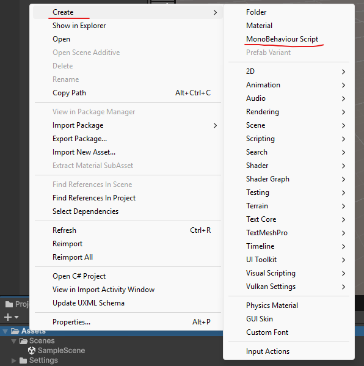
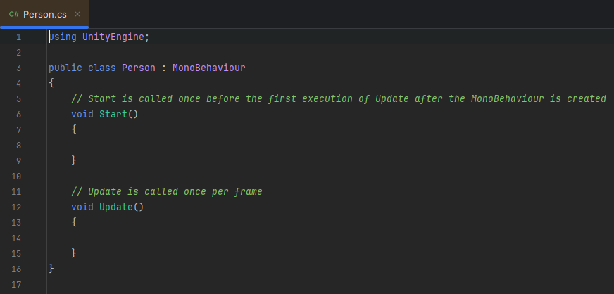
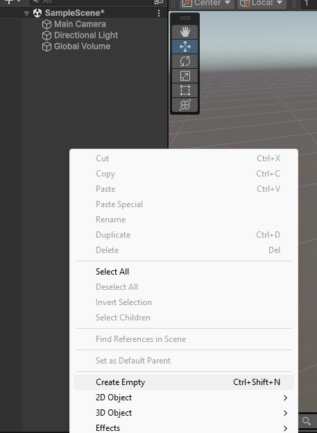
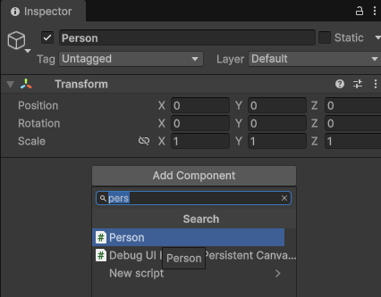
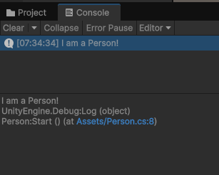

# Exercise

### Classes

We will learn more about what `inheritance`, `Debug class` and `MonoBehaviour` are later in this class, but for now just follow the instructions.

- In your Unity project, create three classes:
  - Person
  - Animal
  - Car

- Right click in the project window, and select `Create` -> `MonoBehaviour Script`:



- Now you can open them up with Rider by double-clicking the newly created script in the project window.



Unity is nice to provide for us a basic setup of the `MonoBehaviour` script that contains two methods and the inherited `MonoBehaviour` class.

Let´s modify the `Start` method like so:

```
void Start() {
    Debug.Log("I am a Person!")
} 
```

And the same for the other two classes.

- Now we can create three new objects by right-clicking in the `Hierarchy` and `Create Empty` and give them their names ( Person, Animal, Car ):



- And let's add our scripts to each of the objects by selecting the object and in the inspector click `Add Component` and searching for the corresponding component:



- Now that our scripts are added to each of the game objects you can hit `Play` and inspect the output in the `Console` window:



Great scott, we have our first log!!